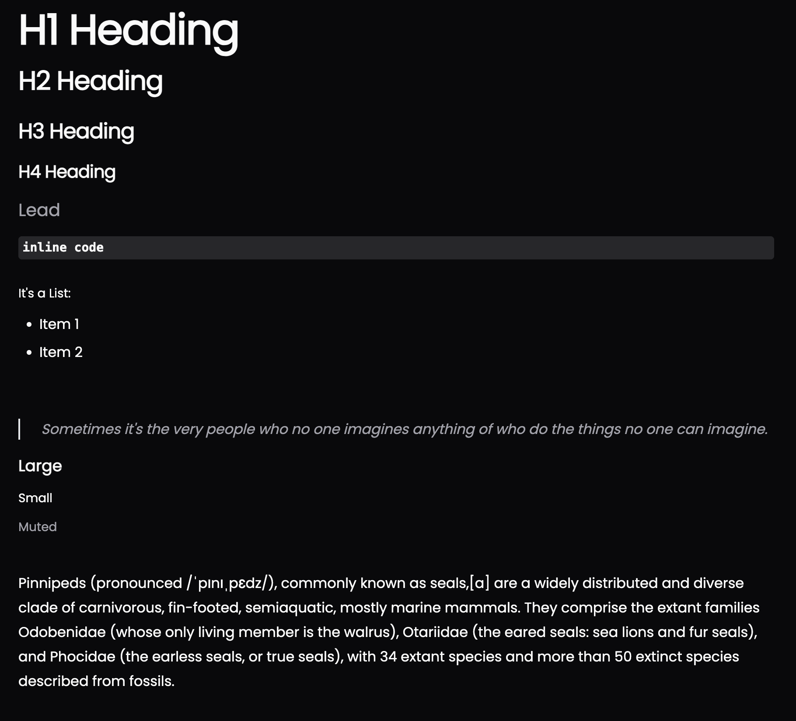

## shadcn/ui inspired typography components

This is a collection of typography components created off of the [shadcn/ui](https://ui.shadcn.com/docs/components/typography) website. The components are built using Tailwind CSS and React. You can use `className` to add additional styles to the components.

#### Table of Contents

1. [Components](#components)
2. [Prerequisites for using the Copy Method](#prerequisites-for-using-the-copy-method)
3. [Installation](#installation)

## Components



`H1` - `H4` - Heading components

> If you want the `H2` to have no underline, add the class `border-none` to the component

```jsx
<div>
	<H1>Big Heading Text</H1>
	<H2>Some smaller Text</H2>
	<H3>Even smaller text</H3>
	<H4>Smallest text</H4>
</div>
```

`P` - Paragraph component

```jsx
<P>I am the paragraph 🦭</P>
```

`Large` - Larger text component

```jsx
<Large>Some large text</Large>
```

`Small` - Obviously a smaller text component

```jsx
<Small>Some damn small text</Small>
```

`Lead` - A large text component for headings

```jsx
<Lead>Some text</Lead>
```

`Quote` - A blockquote component

```jsx
<Quote>
	I like to look at one or two random quotes each morning. It can be a good exercise for
	journaling prompts.
</Quote>
```

`InlineCode` - Inline code component

```jsx
<InlineCode>npm install shadcn-typography</InlineCode>
```

`List` - A list component

```jsx
<List>
	<li>Item 1</li>
	<li>Item 2</li>
	<li>Item 3</li>
</List>
```

## Prerequisites for using the Copy Method

1. twMerge and clsx must be available in the project

```bash
npm install clsx tailwind-merge
```

2. create a file `./lib/utils.tsx` and paste the following:

```tsx
import { type ClassValue, clsx } from 'clsx';
import { twMerge } from 'tailwind-merge';

export function cn(...inputs: ClassValue[]) {
	return twMerge(clsx(inputs));
}
```

## Installation

### Option 1: as Package

```bash
npm install shadcn-typography
```

```bash
yarn add shadcn-typography
```

### Option 2: Copy the components into your project

Create the file `./components/ui/typography.tsx` and paste the following:

```tsx
import React from 'react';
import { cn } from '../../lib/utils';

export function Lead(props: React.HTMLAttributes<HTMLParagraphElement>) {
	return (
		<p {...props} className={cn(props.className, 'text-xl text-muted-foreground')}>
			{props.children}
		</p>
	);
}

export function H1(props: React.HTMLAttributes<HTMLHeadingElement>) {
	return (
		<h1
			{...props}
			className={cn(
				props.className,
				'scroll-m-20 text-4xl font-extrabold tracking-tight lg:text-5xl'
			)}>
			{props.children}
		</h1>
	);
}

export function H2(props: React.HTMLAttributes<HTMLHeadingElement>) {
	return (
		<h2
			{...props}
			className={cn(
				props.className,
				'scroll-m-20 border-b pb-2 text-3xl font-semibold tracking-tight first:mt-0'
			)}>
			{props.children}
		</h2>
	);
}

export function H3(props: React.HTMLAttributes<HTMLHeadingElement>) {
	return (
		<h3
			{...props}
			className={cn(
				props.className,
				'scroll-m-20 text-2xl font-semibold tracking-tight'
			)}>
			{props.children}
		</h3>
	);
}

export function H4(props: React.HTMLAttributes<HTMLHeadingElement>) {
	return (
		<h4
			{...props}
			className={cn(props.className, 'scroll-m-20 text-xl font-semibold tracking-tight')}>
			{props.children}
		</h4>
	);
}

export function P(props: React.HTMLAttributes<HTMLParagraphElement>) {
	return (
		<p {...props} className={cn(props.className, 'leading-7 [&:not(:first-child)]:mt-6')}>
			{props.children}
		</p>
	);
}

export function Large(props: React.HTMLAttributes<HTMLDivElement>) {
	return (
		<div className={cn(props.className, 'text-lg font-semibold')}>{props.children}</div>
	);
}

export function Small(props: React.HTMLAttributes<HTMLParagraphElement>) {
	return (
		<p {...props} className={cn(props.className, 'text-sm font-medium leading-none')}>
			{props.children}
		</p>
	);
}

export function Muted(props: React.HTMLAttributes<HTMLSpanElement>) {
	return (
		<span {...props} className={cn(props.className, 'text-sm text-muted-foreground')}>
			{props.children}
		</span>
	);
}

export function InlineCode(props: React.HTMLAttributes<HTMLSpanElement>) {
	return (
		<code
			className={cn(
				props.children,
				'relative rounded bg-muted px-[0.3rem] py-[0.2rem] font-mono text-sm font-semibold'
			)}>
			{props.children}
		</code>
	);
}

export function List(props: React.HTMLAttributes<HTMLUListElement>) {
	return (
		<ul className={cn(props.className, 'my-6 ml-6 list-disc [&>li]:mt-2')}>
			{props.children}
		</ul>
	);
}

export function Quote(props: React.HTMLAttributes<HTMLQuoteElement>) {
	return (
		<blockquote
			{...props}
			className={cn(
				props.className,
				'mt-6 border-l-2 pl-6 italic text-muted-foreground'
			)}>
			{props.children}
		</blockquote>
	);
}
```
